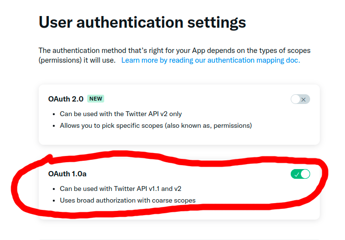
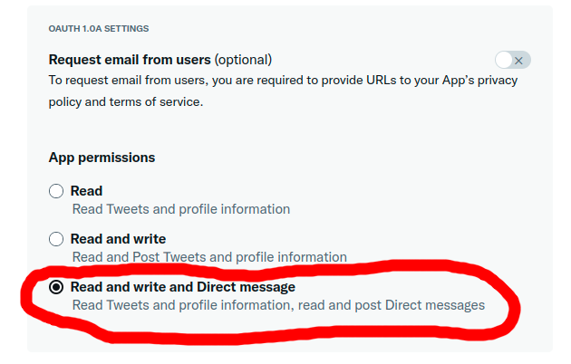
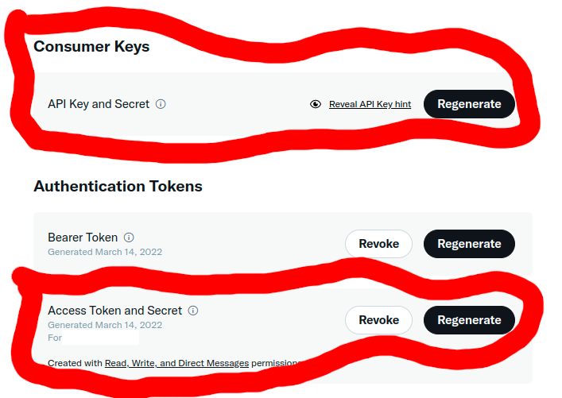

# Twitter DM Bot

## Monitors Twitter topics and sends DMs to users who are trending in those topics

### Requirements

To use this program, a few things are required:

0. Python 3

This assumes you already have Python 3 installed and setup normally on your system.  I developed and tested this program with Python 3.8.10, and have not tested it with any other version.

However, I don't know of any reason why it would not work with other recent versions of Python 3.  But if you encounter problems, try running the program with Python 3.8.10 first, to eliminate any problems that could be caused by an incompatible version.

1. Install required packages listed in `requirements.txt`.

To install the packages needed for this program, navigate to the program folder and run `pip install -r requirements.txt`

2. Google Chrome and Chromedriver

You need to have installed a recent version of Google Chrome.  Once you have that, go to the [Chromedriver Download page](https://chromedriver.chromium.org/downloads) and download the version of Chromedriver that matches the version of Google Chrome you installed.  (Visit [chrome://version](chrome://version) inside of Google Chrome to find this.)

Once you download Chromedriver, you can unzip the archive and put the executable somewhere on your computer that this program will be able to access.  I recommend putting a copy in the `files` folder of this project.

Now that you have Chromedriver on your computer, you need to tell the program where it's located.  You can do this by modifying the line `WEBDRIVER_LOCATION = "files/chromedriver"` at the top of the file `scraper.py`.  The default filepath is `files/chromedriver`, but you'll need to change this to wherever you put the Chromedriver executable.  You also might need to change the extension of the filepath; i.e. `files/chromedriver.exe` for Windows, `files/chromedriver` for Linux, etc.

3. Twitter API **Elevated** Access Level

This program relies on the Twitter API for accessing the account used for the Twitter bot, sending DMs, and looking up User IDs.  It uses v1.1 of the Twitter API; therefore, it requries **Elevated** access level, as the *Essential* access level cannot use v1.1 of the API.

Once you gain **Elevated** access to the API, you can create an app on the Twitter Developer Portal to use for this Twitter Bot.

Then choose to edit the User Authentication Settings; turn on OAuth 1.0a and change App Permissions from "Read" to "Read and write and Direct message" as seen below.




Next, go the the Keys and Tokens page of your App, and then generate/regenerate the "Consumer/API Key and Secret" and "Authentication/Access Token and Secret", as een below.



Once you generate all of these, create a file called `keys.toml` under the `files` folder.  Enter the newly-generated keys and tokens into that file in the following format (Lines beginning with `#` are just comments and are not necessary):


```
# API and OAuth Keys for Twitter API

# Consumer (API)
consumer_key = "XXXXXXX..."
consumer_secret = "XXXXXXX..."

# Authentication
access_token = "XXXXXXX..."
access_secret = "XXXXXXX..."

```

4. Other necessary files

Now, there's just a few more files to create.  Perform the following:

- Create `topics.txt` in `files`

This file will contain URLs of the Twitter topics you wish to monitor with this program.  It looks like this:

```
https://twitter.com/i/topics/1284234742661963776
https://twitter.com/i/topics/1291673117010534401
```

Copy and paste the Twitter topic URL on a new line for each topic you want to monitor.

- Create `messages.txt` in `files`

This file will contain prewritten messages that get randomly chosen and DM'd to users by the Twitter bot.  It looks like this:

```
DM Message 1
DM Message 2
DM Message 3
```

Write a message on a new line for each message you want to include.

- Run `util.py` to initialize the database.

A window should come up and prompt you if you want to initialize the database.  Type 'y' and press enter.  The program should exit, and a file `history.db` should have appeared under the `files` folder.


### Usage

To run the program, just run `main.py` and the program will automatically start.  By default, it is configured to log to console, so all the log messages will appear on your screen as the program works.

There are several options which can be configured for this program. They are each at the top of their relevant source files.  See below for options.

- In `main.py`:

```
PAUSE_TIME = 10 # in minutes (must be at least 1, and no more than 60)
DM_PER_HOUR_LIMIT = 500
LIMIT_DELAY_TIME = 20 # in minutes
```

`PAUSE_TIME` is the number of minutes the program should wait before scanning the listed Twitter topics again.  It's basically how often the program checks the topics for new tweets.

`DM_PER_HOUR_LIMIT` is the maximum limit for how many DM's should be sent within an hour.  If the program reaches that limit within an hour, it will delay so it does not send too many.

`LIMIT_DELAY_TIME` is the number of minutes the program will delay if it reaches the DM per hours limit (see previous option).

- In `util.py`:

```
KEYS_FILE = 'files/keys.toml'
TOPICS_FILE = 'files/topics.txt'
MESSAGES_FILE = 'files/messages.txt'
DATABASE_FILE = 'files/history.db'
LOG_FILE = 'files/log.txt'
LOG_CONFIG = 1
```

`KEYS_FILE`, `TOPICS_FILE`, `MESSAGES_FILE`, `DATABASE_FILE`, and `LOG_FILE` are all filepaths that tell the program where to find/modify files that it uses.  These are all to their default names under the `files` folder.  If you followed the Getting Started section of the README, the files it said to create are under these default filepaths already.  So unless you have a reason, you can leave these unchanged.

`LOG_CONFIG` can be either 0 or 1.  It tells the program if it should output log messages to the console.  If 0, the program only writes log messages to the log file (`log.txt`).  If 1, the program writes log messages to the log file and displays them on the console while the program is running.

- In `scraper.py`:

```
WEBDRIVER_LOCATION = "files/chromedriver"
PAGE_LOAD_TIME = 4 # seconds
SCROLL_PAUSE_TIME = 0.75 # seconds
```

See #2 under Getting Started for more info about `WEBDRIVER_LOCATION`

Both `PAGE_LOAD_TIME` and `SCROLL_PAUSE_TIME` were already tuned during development of this program.  Under normal circumstances, these will not need to be changed.

However, if problems occur while retrieving tweets, increasing these might be necessary, especially with slow connections.  Decreasing these amounts **CAN LEAD TO THE PROGRAM BREAKING**.  So do not change these if it's not necessary.